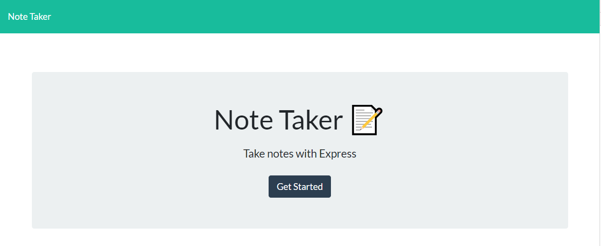
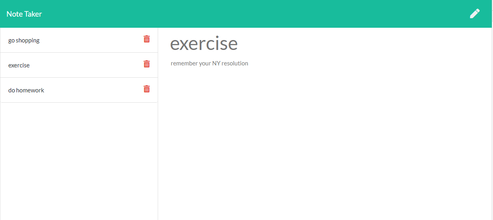

# Note Taker Application

## Description

This application can be used to write, save, and delete notes. This application uses `express` backend and saves and retrieves note data from a JSON file.

The application provides the following API routes:

- GET `/api/notes` - reads the `db.json` file and returns all saved notes as JSON
- POST `/api/notes` - receives a new note to save on the request body, adds it to the `db.json` file, and then returns the new note to the client.
- DELETE `/api/notes/:id` - receives a query parameter containing the id of a note to delete. This means an id is created for each note when the note is added to `db.json`.

## Tools and concepts
* fs package to read/write a file
* util package to convert callback async functions into promise async functions
* express app running the back
* data is stored as json file
* Bootstrap to style
* jQuery to manipulate DOM elelments
* JavaScript in in browser making AJAX calls
* CSS to provide additional styling

***
New note screen
***

***
List of notes
***

